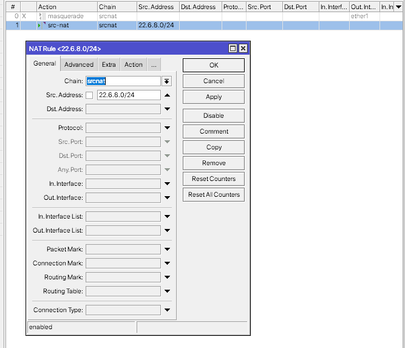
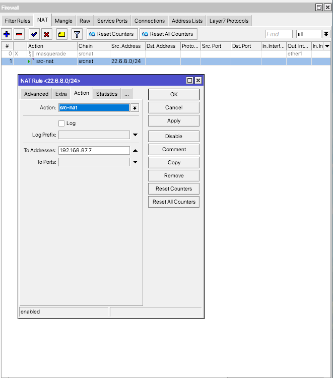
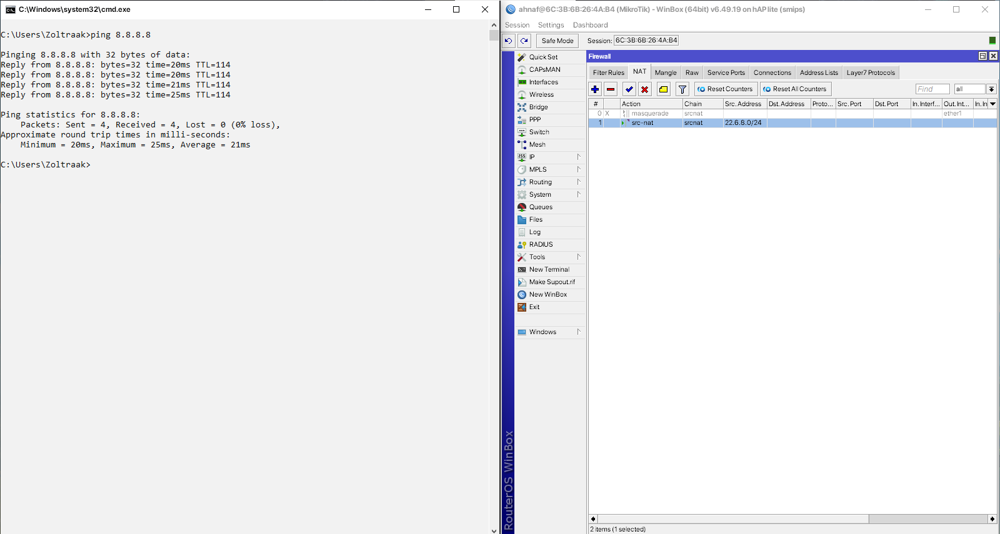
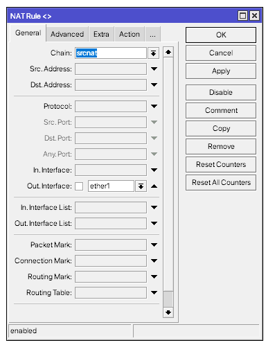
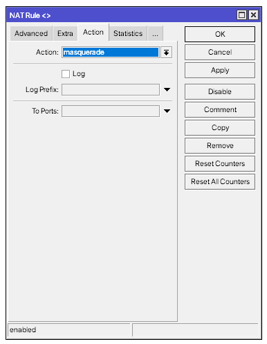
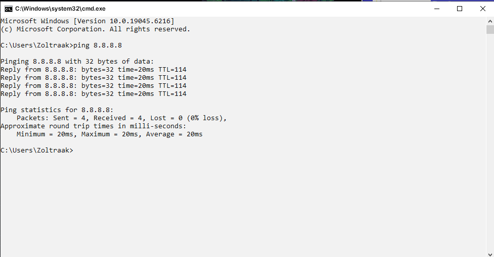

# LAB-45-Firewall-NAT
Selasa 26 Agustus 2025  
  
# Network Address Translation  
  
  
# Chain  
  **srcnat**  
    
  **dstnat**  
  
# Action
  1. src-nat  
     Tindakan NAT yang mengganti IP sumber paket manjadi IP yang ditentukan di **to address** sebelum paket keluar router. Semua paket yang keluar dari jaringan internal (LAN) ke internat akan selalu memakai IP Publik tertentu yang statis. Berbeda dengan masquerade yang dynamic atau netmap. src-nat ditentukan static. Tujuannya agar paket keluar LAN terlihat berasal dari IP publik tertentu.  
     Contoh pengunaan:  
  
     chain=srcnat, Paket keluar LAN > WAN  
     src-address=22.6.8.0/24, Semua IP LAN diproses  
  
     action=src-nat, Ganti IP sumber paket  
     to-addresses=192.168.87.7, IP publik(WAN) statis yang digunakan  
  
     Hasilnya semua perangkat di subnet 192.168.88.0/24 akan terlihat keluar ke internet sebagai IP 192.168.87.7  
       
  2. masquerade  
     NAT otomatis yang mengganti alamat sumber paket dari alamat IP lokal menjadi alamat IP WAN. Untuk menyembunyikan local address dibelik public address yang didapat dari ISP. Dipakai saat semua perangkat di jaringan lokal ingin mengakses internet melalui WAN tanpa konfigurasi IP manual.  
     Contoh penggunaan:  
  
     chain=src-nat, untuk mengubah alamat sumber paket yang keluar dari router.  
     out-interface=ether1, interface yang mengarah ke WAN, NAT hanya berkalu untuk paket keluar lewat interface ini.  
  
     action=masquerade, NAT otomatis mengganti alamat sumber paket ke IP WAN.  
       
     Pengujian:  
     Lakukan ping di PC client untuk mengecek apakah client bisa mengakses internet.  
  
  
  3. accept  
     Menerima paket tanpa menjalankan NAT. Paket tidak lanjut ke next firewall rule. Paket dilewati sehingga tidak diubah alamat IP atau portnya. Digunakan jika ada perangkat di jaringan lokal yang harus tetap menggunakan alamat IP asli saat mengakses internet.  
     Contoh penggunaan:  
  
  
  
     Pengujian:  
     Untuk pengujian, cara mudahnya kita bisa lihat di kolom **Bytes** dan **Packets**, jika angkanya terus bertambah, itu tandanya paket aktif/berjalan.  
  
  
  4. redirect
     Replace destinasi port dari IP packet dengan yang spesifik dari **to-ports** parameter dan destinasi address ke address dari virtual atau physical interface. Mengaarhkan paket ke router itu sendiri. Semua paket LAN diaarahkan ke router sebelum ke internet.
     Contoh Penggunaan:
  
