# LAB-45-Firewall-NAT
Selasa 26 Agustus 2025  
  
# Network Address Translation  
  
  
# Chain  
  **srcnat**  
    Berfungsi untuk melakukan translasi pada alamat sumber paket data, yaitu alamat IP dari perangkat di jaringan lokal yang hendak keluar menuju jaringan lain, biasanya ke internet.  
      
  **dstnat**  
    Digunakan untuk melakukan translasi pada alamat tujuan paket data yang masuk ke jaringan melalui router. FUngsinya adalah mengarahkan paket menuju alamat publik tertentu agar diteruskan ke alamat IP private di dalam jaringan.  
  
# Action
  1. src-nat  
     Tindakan NAT yang mengganti IP sumber paket manjadi IP yang ditentukan di **to address** sebelum paket keluar router. Semua paket yang keluar dari jaringan internal (LAN) ke internat akan selalu memakai IP Publik tertentu yang statis. Berbeda dengan masquerade yang dynamic atau netmap. src-nat ditentukan static. Tujuannya agar paket keluar LAN terlihat berasal dari IP publik tertentu.  
     Contoh pengunaan:  
  
     chain=srcnat, Paket keluar LAN > WAN  
     src-address=22.6.8.0/24, Semua IP LAN diproses  
  
     action=src-nat, Ganti IP sumber paket  
     to-addresses=192.168.87.7, IP publik(WAN) statis yang digunakan  
  
     Hasilnya semua perangkat di subnet 192.168.88.0/24 akan terlihat keluar ke internet sebagai IP 192.168.87.7  
       
  2. masquerade  
     NAT otomatis yang mengganti alamat sumber paket dari alamat IP lokal menjadi alamat IP WAN. Untuk menyembunyikan local address dibelik public address yang didapat dari ISP. Dipakai saat semua perangkat di jaringan lokal ingin mengakses internet melalui WAN tanpa konfigurasi IP manual.  
     Contoh penggunaan:  
  
     chain=src-nat, untuk mengubah alamat sumber paket yang keluar dari router.  
     out-interface=ether1, interface yang mengarah ke WAN, NAT hanya berkalu untuk paket keluar lewat interface ini.  
  
     action=masquerade, NAT otomatis mengganti alamat sumber paket ke IP WAN.  
       
     Pengujian:  
     Lakukan ping di PC client untuk mengecek apakah client bisa mengakses internet.  
  
  
  3. accept  
     Menerima paket tanpa menjalankan NAT. Paket tidak lanjut ke next firewall rule. Paket dilewati sehingga tidak diubah alamat IP atau portnya. Digunakan jika ada perangkat di jaringan lokal yang harus tetap menggunakan alamat IP asli saat mengakses internet.  
     Contoh penggunaan:  
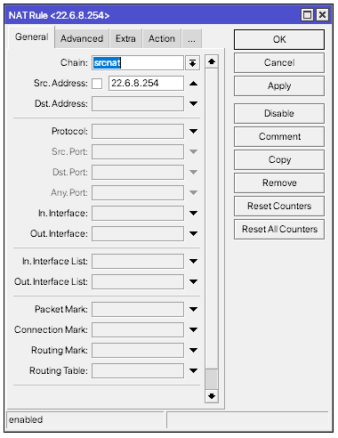  
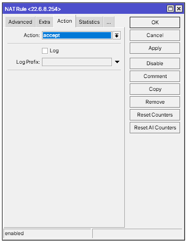  
     Pengujian:  
     Untuk pengujian, cara mudahnya kita bisa lihat di kolom **Bytes** dan **Packets**, jika angkanya terus bertambah, itu tandanya paket aktif/berjalan.  
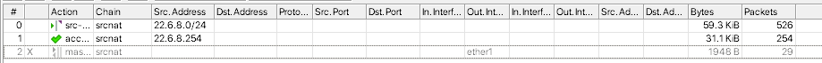  
  
  4. redirect  
     Replace destinasi port dari IP packet dengan yang spesifik dari **to-ports** parameter dan destinasi address ke address dari virtual atau physical interface. Mengaarhkan paket ke router itu sendiri. Semua paket LAN diarahkan ke router sebelum ke internet.  
     Contoh Penggunaan:  
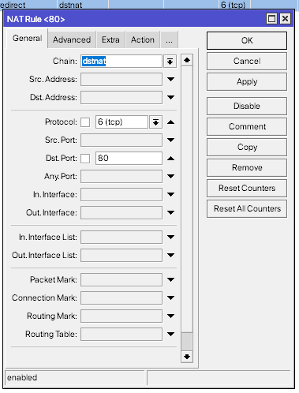
dst-address, IP tujuan paket
dst-port, port tujuan paket  
protocol, protokol paket  
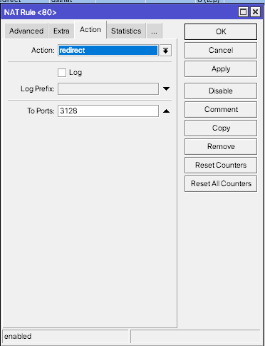  
action=redirect, paket diarahkan ke router sendiri  
to-ports, port di router yang akan menerima paket (3128 untuk proxy)  
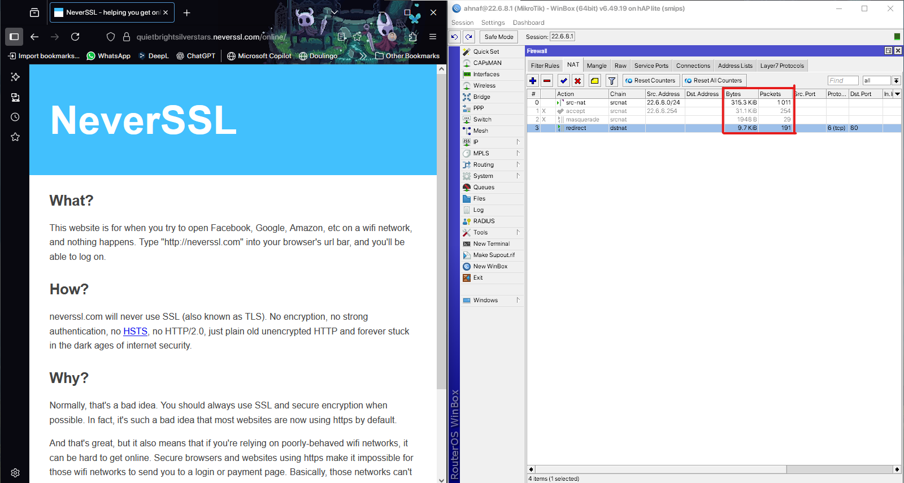  
  
  6. add-dst-to-address-list  
     Untuk menambah tujuan paket (destination IP) kedalam **address list**. Tidak mengubah paket, hanya mencatat alamat tujuan untuk keperluan firewall, NAT atau monitoring.  
     Contoh penggunaan:  
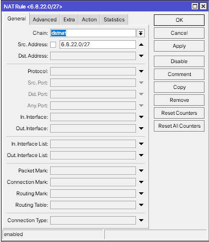  
dst-address, jika kosong, semua IP tujuan ditambahkan.  
src-address, jika kosong, semua ip sumber akan ditambahkan.  
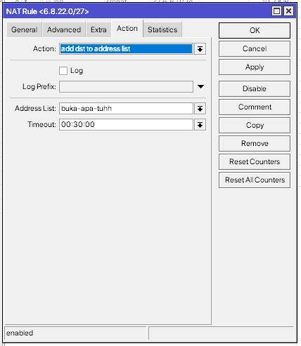  
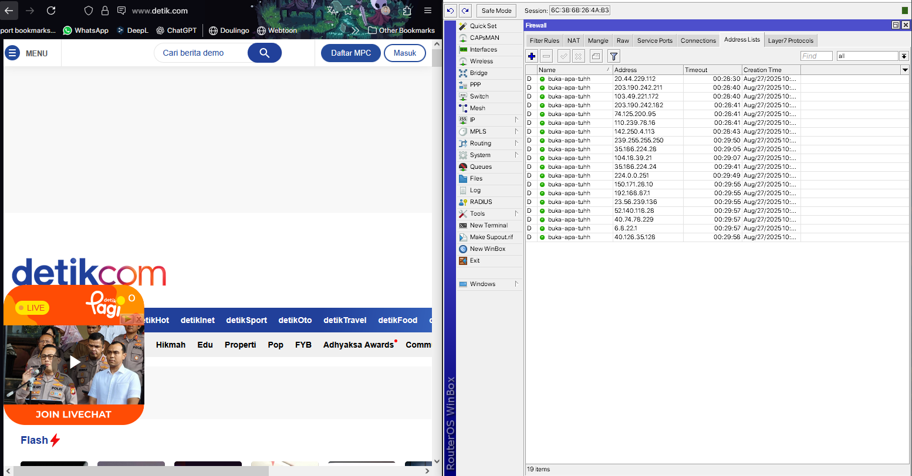  
    
  7. add-src-to-address-list  
     Untuk menambahkan alamat sumber ke dalam **address list**. Tidak mengubah paket, hanya mencatat alamat sumber untuk keperluan firewall, NAT, atau monitoring.  
     Contoh penggunaan:  
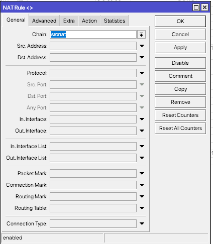  
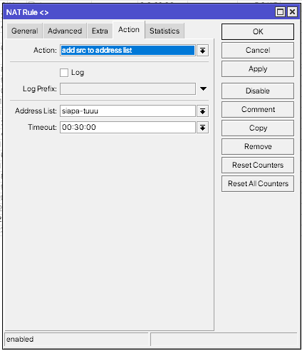  
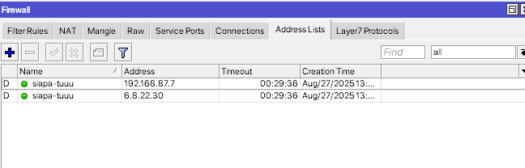  
    
  8. jump  
     Digunakan untuk melompat ke chai nlain(custom chain). Tujuannya untuk memisahkan rule NAT yang spesifik agar chain utama tetap rapi dan lebih mudah diatur. Jadi NAT tidak di proses di rule utama lagi, tapi di proses di chain target.  
     Contoh Pengunaan:  
  
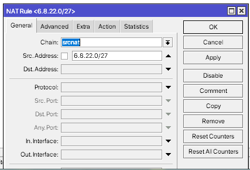  
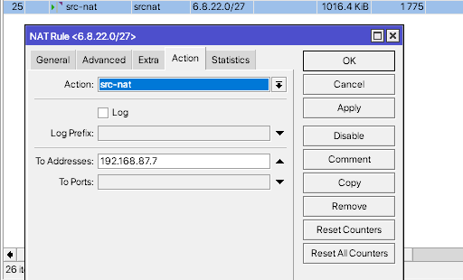  
  
  9. log  
     Digunakan  untuk mencatat paket data yang sesuai dengan rule kedalam sistem log router.  Jadi kalau ada paket yang memenuhi kondisi rule misalnya berdasarkan IP, port atau protokol paket itu tidak diubah dan tidak diblokir melainkan hanya dibuatkan catatan di sistem log.  
     Contoh penggunaan:  
     Disini saya akan membuat jika IP di network 6.8.22.0/27 mengakses https akan masuk kedalam log.  
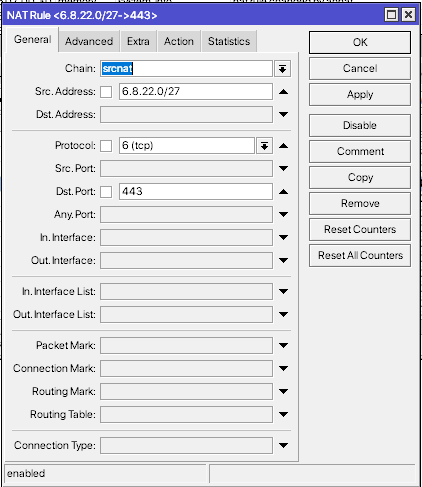  
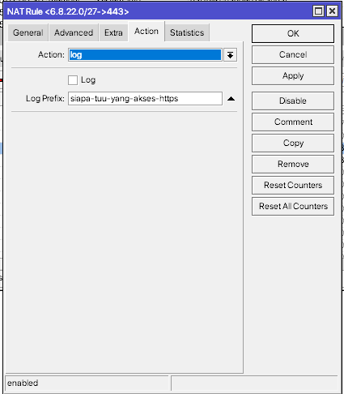  
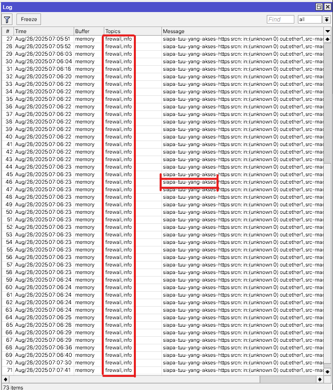
  
  11. same  
      Digunakan jika LAN memiliki prefix yang berbeda dengan prefix IP public. same lebih banyak digunakan pada SRCNAT. Salah satunya ketika koneksi client pada service tertentu dibatasi, sehingga digunakan same agar tidak terlalu banyak koneksi client ke arah server.
      Contoh penggunaan:  
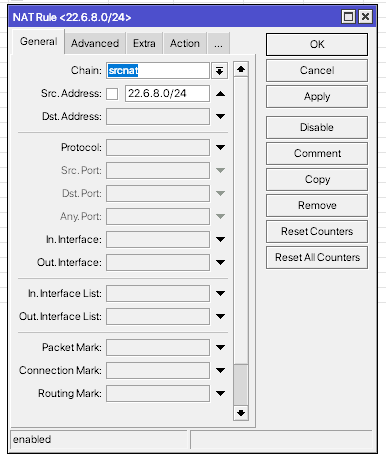  
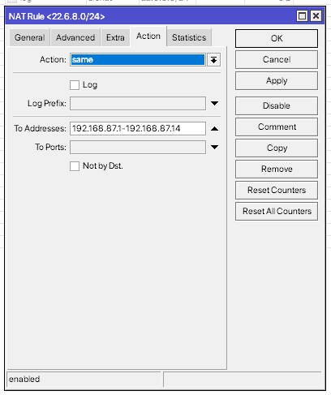  
      Pastikan PC Client yang terhubung bisa akses internet dan di winbox bytes dan packetnya berjalan yang menandakan firewall berfungsi.  
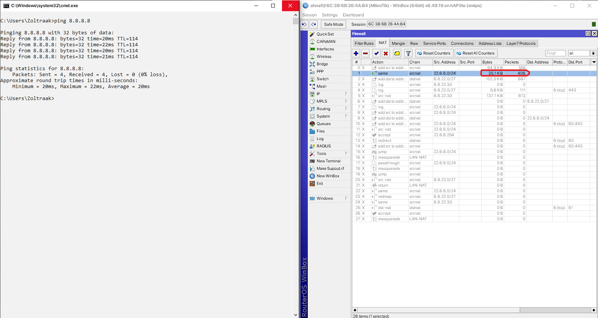
  
  13. dst-nat  
      Dipakai untuk mengarahkan trafik dari IP/Port tertentu ke alamat IP tujuan lain di jaringan lokal. Biasanya dipakai kalau ada server di dalam LAN dan kita ingin akses dari luar.
      Contoh penggunaan:  
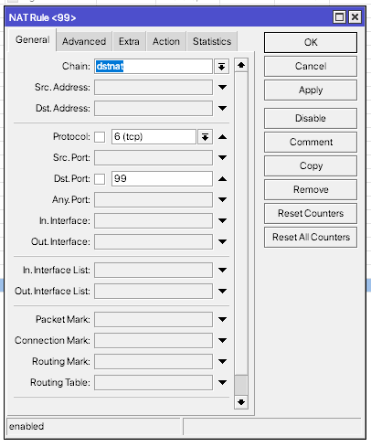  
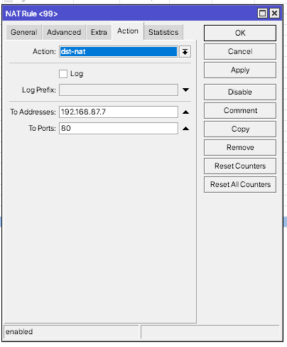  
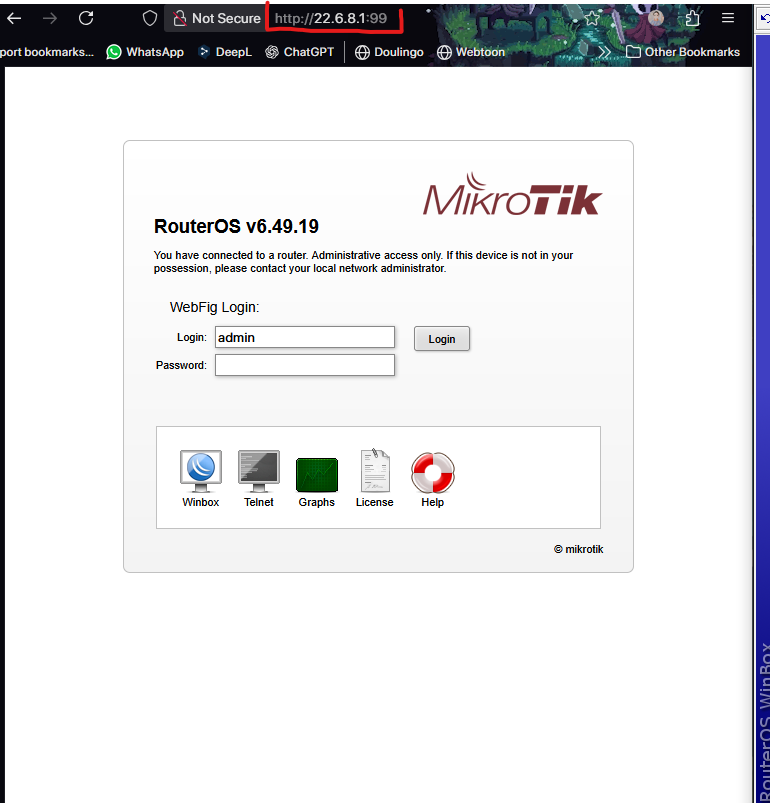
    
  14. netmap  
      Melakukan perubahan IP Address dengan metode mapping 1:1 yang dapat diterapkan pada SRCNAT maupun DSTNAT. Syarat utamanya kedua subnet harus memiliki prefix atau jumlah host yang sama. Netmap akan memetakan masing-masing IP ke alamat IP subnet lain dengan host yang sama.  
      Contoh penggunaan:  
  
  
  
    
  15. passthrough  
      Membiarkan paket tetap diteruskan ke rule berikutnya tanpa diubah apapun. Jika paket dicheck dan match tetap dilepas ke rule selanjutnya.  
      Contoh penggunaan:  
  
  
  
    
  16. return  
      Agar paket berhenti  diperiksa di chain sekarang, lalu balik ke chain asal yang memanggilnya.  Kalau dipakai di chain utama NAT (srcnat dstnat), efeknya hampir sama seperti accept, paket tidak akan di NAT lagi tapi berbeda tempat berhentinya. return fungsinya hanya dipakai kalau ada chain custom.
      Contoh penggunaan:  
  
  

# Kesimpulan
  Berfungsi sebagai mekanisme untuk menerjemahkan alamat IP dan port dari paket data yang melewati router. Proses ini memungkinkan koneksi dari jaringan lokal menuju internet maupun sebaliknya dapat berjalan dengan baik meskipun menggunakan alamat yang berbeda. NAT bekerja dengan cara mengubah alamat sumber (source) pada saat paket keluar dari router melalui chain srcnat, serta dapat mengubah alamat tujuan (destination) pada saat paket masuk melalui chain dstnat.
